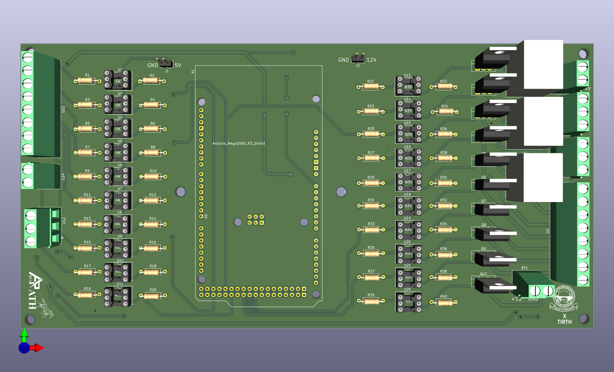
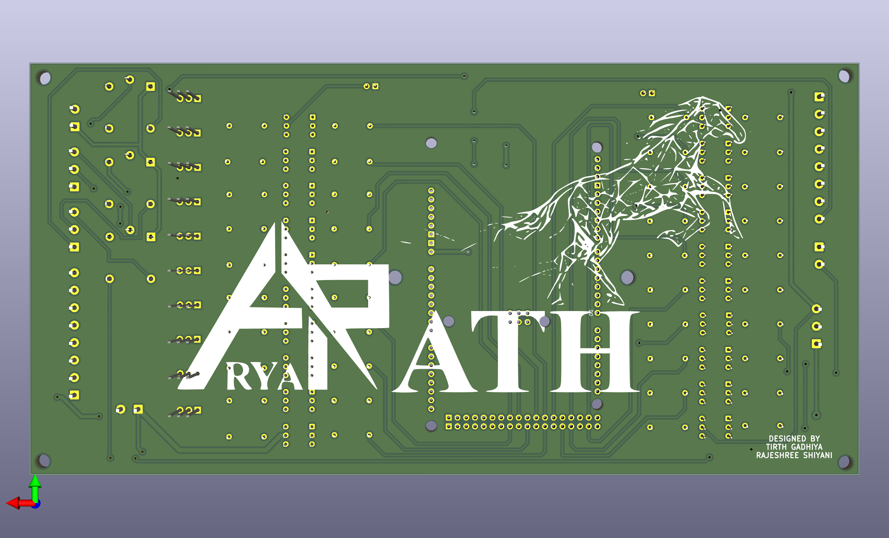
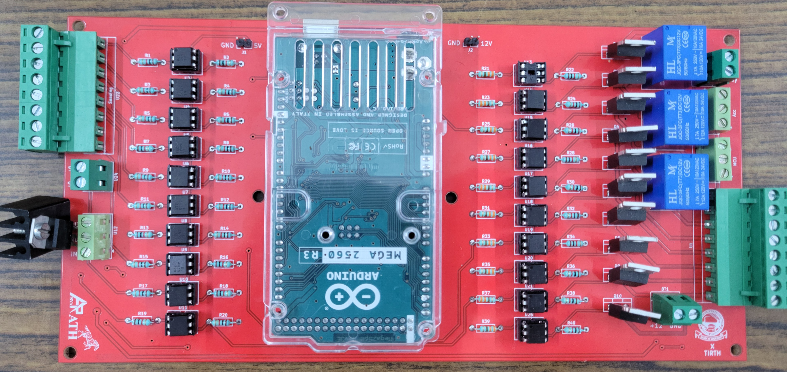

# **TEAM ARYARATH**

# SAE-eBaja2026-PCB

2-layer PCB design for SAE eBaja 2026 electric vehicle - designed in KiCad

\---

## **🚗 VCU — Vehicle Control Unit | SAE eBaja 2026 \& ATVC 2026**

**!\[PCB](3D-Renders/PCB-1-Front.jpg)**

**!\[PCB](3D-Renders/PCB-2-Back.png)**

**!\[PCB Photo](3D-Renders/PCB-Image.jpg)**

\---

## **📌 Overview**

**A fully functional 2-layer Vehicle Control Unit (VCU) PCB designed for the**

**SAE eBaja 2026 and ATVC 2026 electric Baja vehicle. This board manages the**

**entire 12V low-voltage control circuit of the vehicle.**

**---**

## **⚙️ Features**

**- ✅ Accelerator control**

**- ✅ Brake control with brake light output**

**- ✅ Reverse light \& reverse alarm**

**- ✅ LV (Low Voltage) indicator light**

**- ✅ HV (High Voltage) indicator light**

**- ✅ Key switch integration**

**- ✅ Optocoupler-based isolation for safety**

**- ✅ MOSFET-driven outputs**

**- ✅ Relay control for high current loads**

**---**

## **🛠️ Components Used**

**| Arduino Mega 2560 | Main microcontroller |**

**| MOSFETs | Switching outputs |**

**| Optocouplers | Electrical isolation |**

**| Relays | High current load switching |**

**---**

## **🖼️ 3D Renders**

**---**

## **📷 Actual PCB Photo**

**---**

## **🏆 Competition**

**- SAE eBaja 2026**

**- ATVC 2026**

**---**

## **🧰 Tools Used**

**- KiCad (PCB Design)**

**- Proteus (Circuit Simulation)**

**- Arduino IDE (Programming)**

**---**

## **👨‍💻 Author**

**Tirth Gadhiya**

**Electronics \& Communication Engineering**

**Birla Vishvakarma Mahavidyalaya, Anand**

